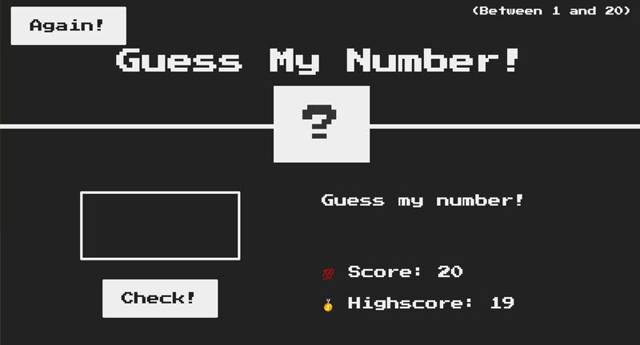

# js-game-guess-my-number
A vanilla JavaScript game to guess a number. Keep guessing until you get the score correct. When you do the game stops and shows you that you've won. Finally click the Again button to reset the game. 

## How Its Done
Vanilla JavaScript and DOM manipulation. This teaches simple game logic, organizing code, and refactoring using DRY principle.

